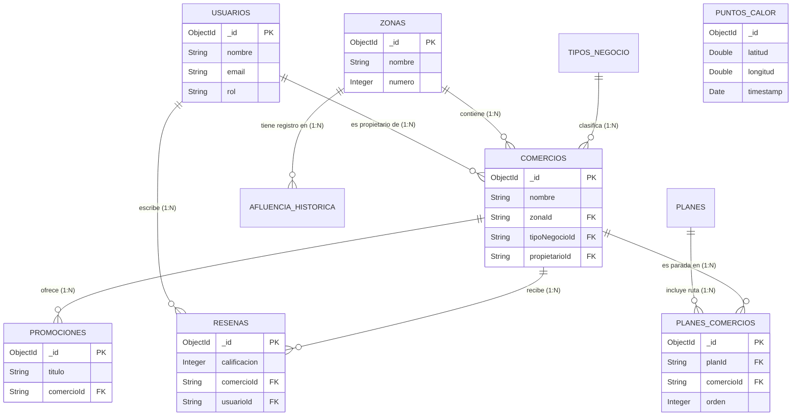

# Diagrama de Entidad-Relación - Go Cartacho (MongoDB)

Aunque MongoDB es una base de datos NoSQL, el proyecto utiliza un modelo relacional robusto mediante referencias cruzadas (guardando el `ObjectId` como texto). A continuación, se presenta el diagrama estructural de las colecciones.

## 1. Diagrama Visual (Mermaid)

Puedes visualizar este diagrama nativamente en GitHub, Notion o pegando este bloque en Mermaid Live Editor.

## 2. Tipos de Relaciones Explicadas

### Relaciones de Uno a Muchos (1:N)
Son la base de la mayoría de las colecciones. El `ObjectId` de la entidad "Padre" se guarda dentro de los múltiples documentos "Hijo".
*   **`Zonas` (1) ➔ (N) `Comercios`:** Una zona geográfica (ej. Getsemaní) contiene cientos de comercios, pero un comercio específico solo pertenece a una zona. La colección de comercios guarda el `zonaId`.
*   **`Tipos_Negocio` (1) ➔ (N) `Comercios`:** La categoría "Restaurante" se aplica a muchos comercios, pero un local solo tiene una categoría principal (`tipoNegocioId`).
*   **`Usuarios` (1) ➔ (N) `Comercios`:** Un usuario administrador o comerciante puede ser dueño de varias sucursales o locales (`propietarioId`).
*   **`Comercios` (1) ➔ (N) `Promociones`:** Un negocio puede lanzar múltiples ofertas a la vez (`comercioId` en coleccion `promociones`).
*   **`Comercios` (1) ➔ (N) `Reseñas`:** Un local recibe incontables comentarios de diferentes visitantes.
*   **`Usuarios` (1) ➔ (N) `Reseñas`:** Un turista puede opinar y calificar en muchos negocios distintos.

### Relaciones de Muchos a Muchos (M:N)
*   **`Planes` (M) ➔ (N) `Comercios`:** Un Plan Turístico agrupa varios negocios en una ruta, y un local famoso puede aparecer recomendado en múltiples planes distintos.
    *   *¿Cómo se conecta en MongoDB?* A través de la colección pivote o intermedia **`planes_comercios`**. Esta guarda el par (`planId` + `comercioId`) y le añade datos útiles para la relación, como el `orden` (paso 1, paso 2) y la `recomendacion` del lugar en ese recorrido específico.

### Colecciones Independientes o Flotantes
*   **`puntos_calor`:** Esta colección no tiene relaciones foráneas (FK) directas con ninguna otra colección. Su naturaleza es puramente estadística y efímera: guarda coordenadas abstractas y la hora de captura para generar la mancha térmica en el mapa en vivo de Leaflet. Se limpia a sí misma con el tiempo.